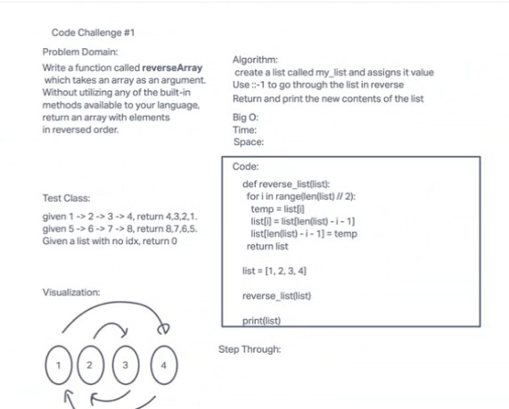

# Challenge Title

using whiteboard

## Whiteboard Process

## Approach & Efficiency

big O is something we need some more revision on, and reading up on w3schools to help come up with a solution.

## Solution

    def reverse_list(list):
      for i in range(len(list) // 2):
        temp = list[i]
        list[i] = list[len(list) - i - 1]
        list[len(list) - i - 1] = temp
      return list
    list = [1, 2, 3, 4]
    reverse_list(list)
    print(list)

## credits

Dan Quinn
