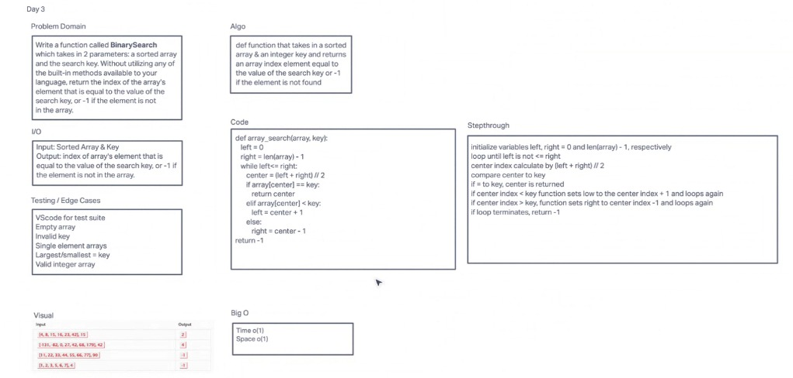

# Challenge Title

binary search

## Whiteboard Process

## Approach & Efficiency

Time: O(1)
Space: O(1)

## Solution

      def array_search(array, key):
        left = 0
        right = len(array) - 1
        while left<= right:
          center = (left + right) // 2
          if array[center] == key:
            return center
          elif array[center] < key:
            left = center + 1
          else:
            right = center - 1
      return -1

## contribution

Andrew Carroll
