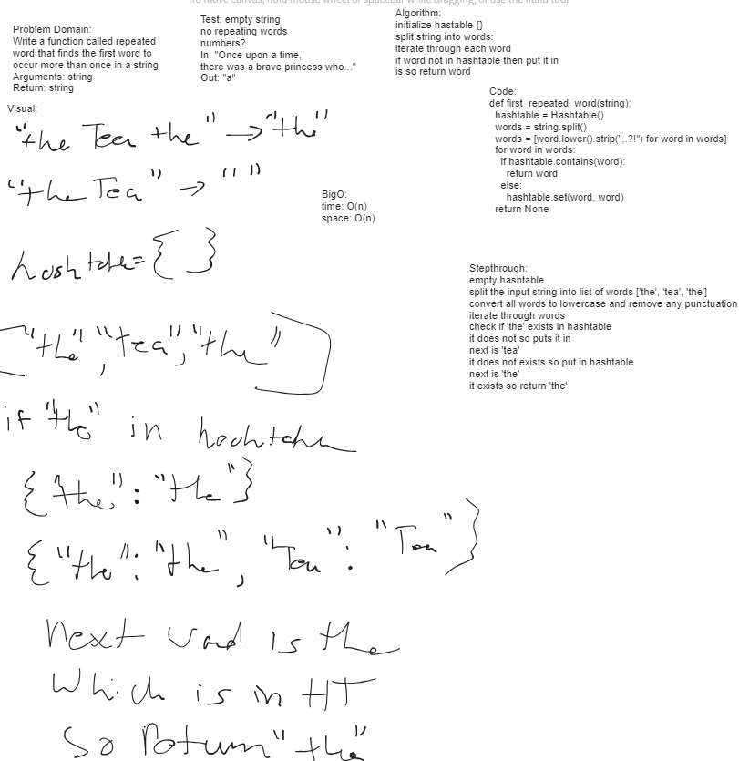

# hashtables repeat first word

    Write a function called repeated word that finds the first word to occur more than once in a string
    Arguments: string
    Return: string

## contribution

sarah glass, slava makeev, andrew carroll, logan reese, jared ciccarello, logan reese

## testing

cd into the test/datastructure, run pytest test_hashtable_repeated_word.py

## note

My solution for my hashtable class, does pass the test_hashtable.py tests, but won't work for future hashtable assignments because of how it is written. ***I worked with Slava so I yoinked his code.*** I believe the reason mine won't work is that I make a list of lists for my hashtable, which i don't think is ideal, while Slavas utilizes Linked List.

## whitebaord

