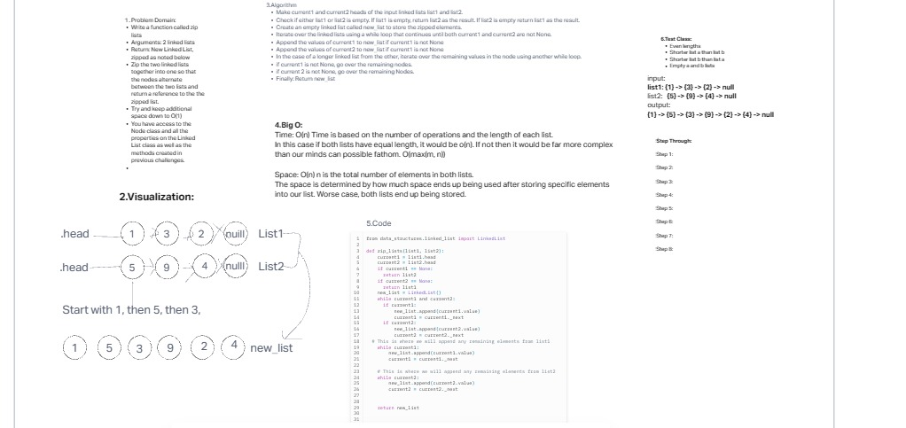

# Challenge Title

zipped linked lists - function that takes in 2 linked lists and returns new linked list zipped,

## Approach & Efficiency

Time: O(n)
Space: O(n)

## contribution

dan quinn, jared ciccarelo, andrew carroll

## Solution

run pytest tests/code_challenges/test_linked_list_zip.py   from root

