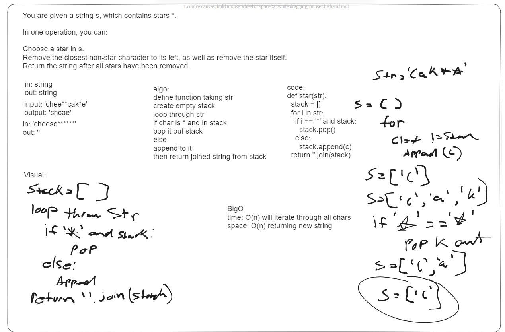
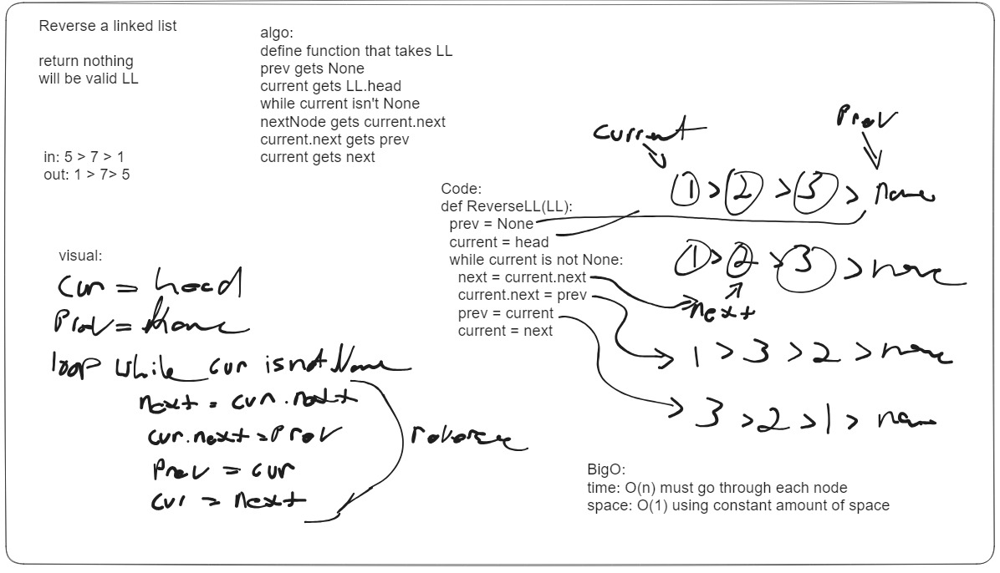

# lab 36

## whiteboard one

You are given a string s, which contains stars *.

In one operation, you can:

Choose a star in s.
Remove the closest non-star character to its left, as well as remove the star itself.
Return the string after all stars have been removed.

## whiteboard two

Reverse a linked list

return nothing
will be valid LL

