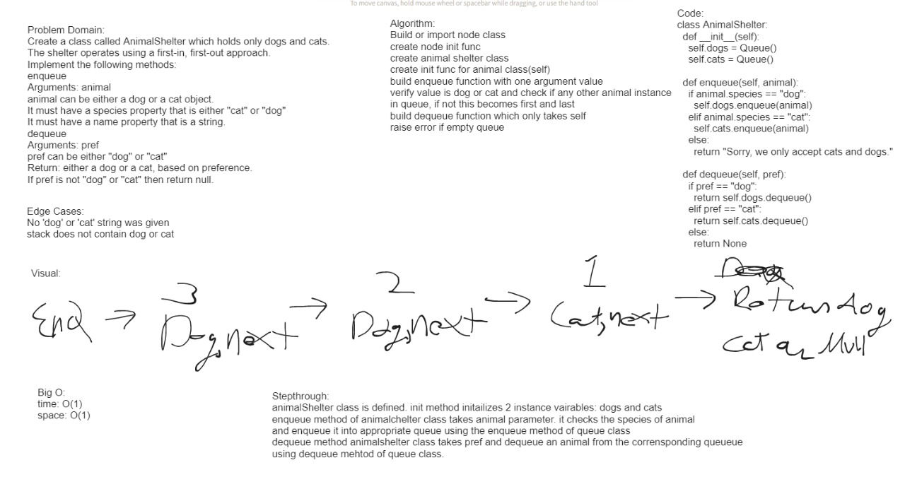

# Challenge Title

stack queue animal shelter

## Approach & Efficiency

time complexity: O(1)
space complexity: O(1)

## contribution

jared ciccarelo, Logan reese, sarah glass, slava makeev, dan quinn

## Solution

run  pytest tests/code_challenges/test_stack_queue_animal_shelter.py  from root

## whitebaord

