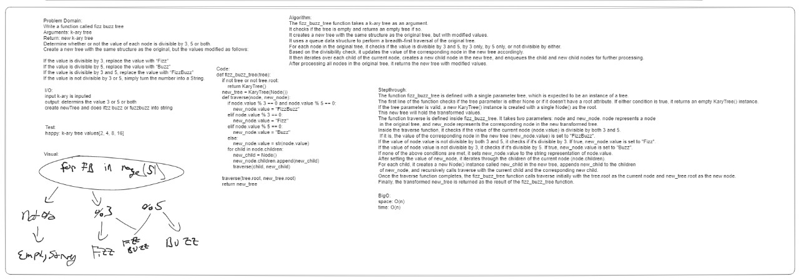

# Challenge Title

tree fizz buzz

## Approach & Efficiency

time complexity: O(n)
space complexity: O(n)

## contribution

jared ciccarelo, Logan reese, sarah glass, slava makeev, dan quinn

## Solution

run  pytest tests/code_challenges/test_fizz_buzz.py  from root

## whitebaord

