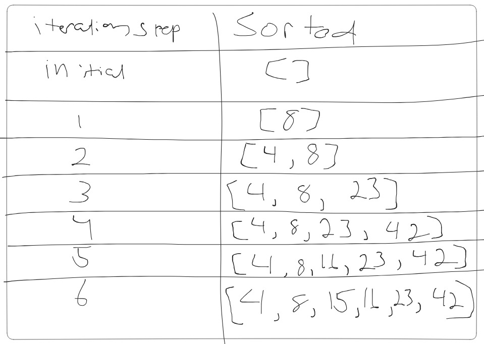

# Blog Notes: Insertion Sort

Initialize sorted as empty array, sorted=[], start iteration with first element of input, input[0]=8, since sorted is empty we directly add 8 to sorted, sorted=[8]

Move to next element, input[1]=4, we need to insnert 4 into correct position in sorted.

Go through Insert funciton: i gets 0, value gets 4 and sorted[i] gets 8, since 4 is less than 8 we stop first loop.

Second while loop: temp gets sorted[i] which is 8,

sorted[i] gets value which is 4,

value gets temp which is 8,

increment i

second loop ends and append value (8 now) to sorted, sorted=[4, 8]

Move to next element, input[2] gets 23, insert 23 into sorted,

i gets 0

value gets 23 and sorted[i] gets 4, since 23 > 4 we increment i: i=1

value gets 23 and sorted[i] gets 8, since 23 > 8 we increment i: i=2

i equal to length of sorted (2 now), exit first loop,

append value (23) to sorted: sorted=[4, 8, 23],

continue process with next element, input[3]=42

i gets 0,

value gets 42 and sorted[i] gets 4, since 42 > 4, increment i: i=1

value gets 42 and sorted[i] gets 8, since 42 > 8, increment i: i=2

value gets 42 and sorted[i] gets 23, since 42 > 23, increment i: i=3

i equal to length of sorted which is 3, exit while loop

append value (42) to sorted: sorted=[4, 8, 23, 42]

we handle input[4]=16

i gets 0

value gets 16 and sorted[i] gets 4, since 16 > 4, increment i: i=1

value gets 16 and sorted[i] gets 8, since 16 > 8, increment i: i=2

value gets 16 and sorted[i] gets 23, since 16 <> 23, increment i: i=3 stop while loop

append value (16) to sorted at current position of i: sorted=[4, 8, 16, 23, 42]

process input[5] gets 15

i gets 0

value gets 15 and sorted[i] gets 4, since 15 > 4, increment i: i=1

value gets 15 and sorted[i] gets 8, since 15 > 8, increment i: i=2

value gets 15 and sorted[i] gets 16, since 15 < 16, stop while loop

append value (15) to sorted at current position of i: sorted=[4, 8, 15, 16, 23, 42]

time complexity: O(n^2) because of the nested while loop

space complexity: O(1) because the array is sorted in place

- pytest sorting/insertion/test_insertion.py
