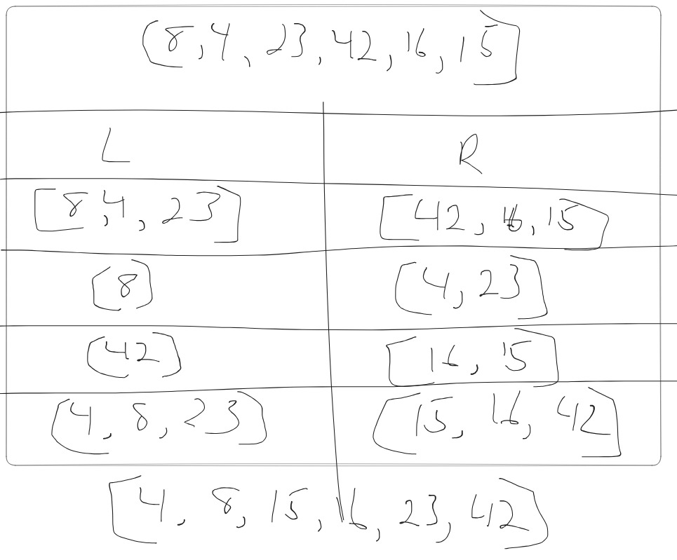

# Blog Notes: Merge Sort

Merge Sort is a divide-and-conquer algorithm, divide problem into smaller subproblems and solution to these subproblems are combined to solve original problem.

- Divide: The array is divided into two halves, approximately equal in size.

- Conquer: Each half is sorted recursively using Merge Sort.

- Merge: The two sorted halves are merged back together to produce the final sorted array.

## Pseudo

        ALGORITHM Mergesort(arr)
            DECLARE n <-- arr.length

            if n > 1
              DECLARE mid <-- n/2
              DECLARE left <-- arr[0...mid]
              DECLARE right <-- arr[mid...n]
              // sort the left side
              Mergesort(left)
              // sort the right side
              Mergesort(right)
              // merge the sorted left and right sides together
              Merge(left, right, arr)

        ALGORITHM Merge(left, right, arr)
            DECLARE i <-- 0
            DECLARE j <-- 0
            DECLARE k <-- 0

            while i < left.length && j < right.length
                if left[i] <= right[j]
                    arr[k] <-- left[i]
                    i <-- i + 1
                else
                    arr[k] <-- right[j]
                    j <-- j + 1

                k <-- k + 1

            if i = left.length
              set remaining entries in arr to remaining values in right
            else
              set remaining entries in arr to remaining values in left

Mergesort function takes arr and recursively divides arr into two halves till individual element is reached. Then merge the sorted halves using Merge function.

Merge function takes three parameters: left, right, arr. compares elements from left and right arr and places them in correct order in original arr.

***
Initial arr: [8, 4, 23, 42, 16, 15]

Divide arr into two halves:

- left: [8, 4, 24]

- right: [15, 16, 42]

Recursively sort left and right arr's:

- left: [4, 8, 23]

- right: [15, 16, 42]

Merge the two sorted halves back into original arr:

- arr: [4, 8, 15, 16, 23, 42]

***

Initial call to Mergesort(arr) with the original input array arr.

DECLARE n <-- arr.length, where n is the length of the input array.

Check if n > 1.

If n > 1, calculate the middle index mid <-- n/2.

Split the input array into two sub-arrays: left <-- arr[0...mid] and right <-- arr[mid...n].

Call Mergesort(left) to sort the left sub-array.

Now, we enter the recursion for the left sub-array:

  a. DECLARE n <-- left.length, where n is the length of the left sub-array.

  b. Check if n > 1.

  c. If n > 1, calculate the middle index mid <-- n/2.

  d. Split the left sub-array into two sub-arrays: left_left <-- left[0...mid] and left_right <-- left[mid...n].

  e. Call Mergesort(left_left) to sort the left side of the left sub-array.

  f. Now, we enter the recursion for the left side of the left sub-array (left_left):

  i. DECLARE n <-- left_left.length, where n is the length of the left_left sub-array.

  ii. Check if n > 1.

  iii. If n > 1, calculate the middle index mid <-- n/2.

  iv. Split the left_left sub-array into two sub-arrays: left_left_left <-- left_left[0...mid] and left_left_right <-- left_left[mid...n].

  v. Call Mergesort(left_left_left) to sort the left side of the left_left sub-array.

  vi. Now, we enter the recursion for the left side of the left_left sub-array (left_left_left). Depending on the length of this sub-array, further recursive calls will be made or sorting will be performed directly using Merge function.

  g. Similarly, we continue with the recursion for the right side of the left sub-array (left_right). This will lead to further recursive calls or direct sorting using the Merge function.

Now, after sorting the left sub-array, we call Mergesort(right) to sort the right sub-array. This will go through similar recursive steps as we did for the left sub-array.

Once both the left and right sub-arrays are sorted, we merge them together using the Merge function.

In the Merge function, we initialize i, j, and k to 0.

We enter a while loop that runs as long as i < left.length and j < right.length.

In each iteration of the while loop, we compare the elements at indices i and j of the left and right sub-arrays, respectively.

If the element in the left sub-array (left[i]) is less than or equal to the element in the right sub-array (right[j]), we place left[i] in the merged array (arr) at index k, and increment both i and k.

If the element in the right sub-array (right[j]) is less than the element in the left sub-array (left[i]), we place right[j] in the merged array (arr) at index k, and increment both j and k.

We repeat steps 12-14 until either the left or right sub-array is fully processed.

If there are remaining elements in the left sub-array (i = left.length), we copy these elements to the merged array (arr) starting from index k.

If there are remaining elements in the right sub-array (j = right.length), we copy these elements to the merged array (arr) starting from index k.

The Merge function is now complete, and we return to the previous recursive call level.

This process repeats until we reach the initial call level, where the entire array has been sorted, and the algorithm terminates.

